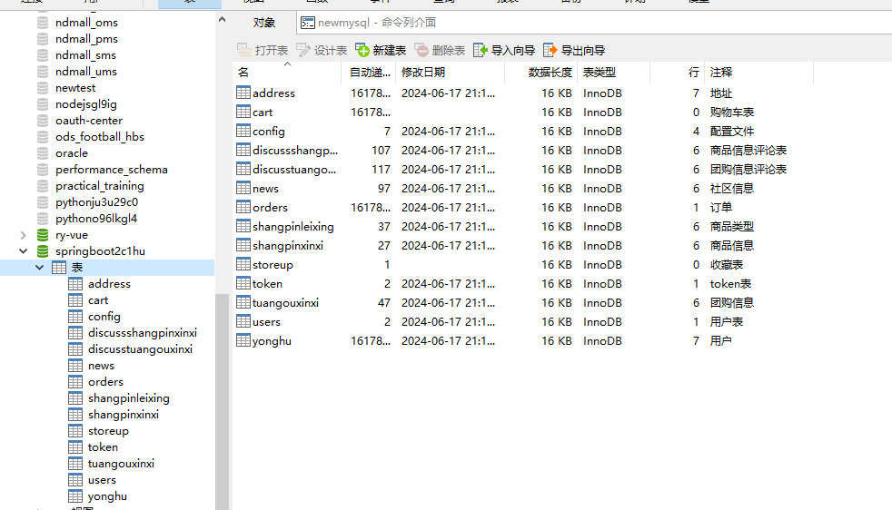
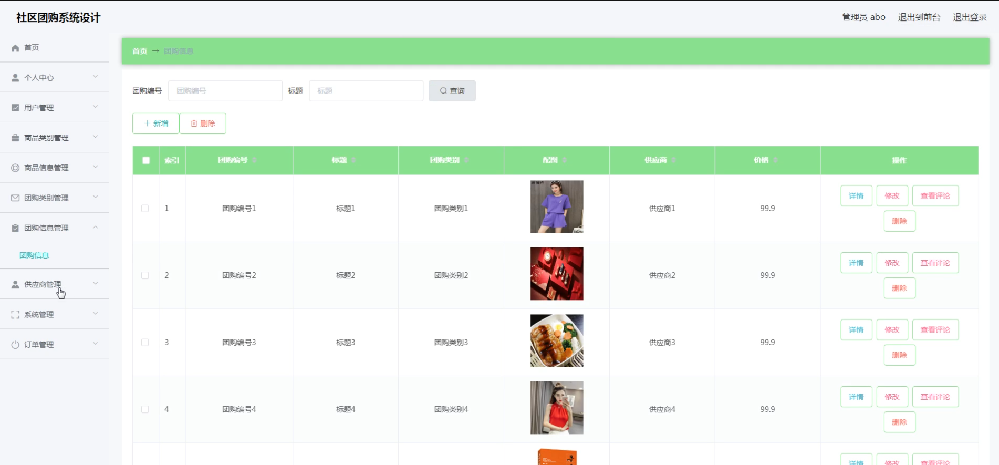

# 基于springboot的社区团购系统设计

#### 介绍

本系统是一款基于Springboot开发的社区团购平台，旨在通过信息化手段，为社区居民提供便捷、高效的团购服务。系统设计简洁直观，功能完善，覆盖了管理端和用户端的各类需求。通过该系统，用户可以轻松参与团购，享受优质商品与服务，而管理端则能高效管理商品、团购活动及用户信息，提升整体运营效率。

#### 技术栈介绍

后端技术栈：Springboot+Mysql+Maven

前端技术栈：Vue+Html+Css+Javascript+ElementUI

开发工具：Idea+Vscode+Navicate

#### 系统功能介绍

管理端功能模块

个人中心：管理人员可以在个人中心查看和修改个人信息，确保账户信息的准确性和安全性。

用户管理：管理端可以新增、删除和编辑用户信息，便于用户信息的统一管理和维护。

商品类别管理：管理端可以管理商品类别信息，方便商品的分类管理和检索。

商品信息管理：管理端可以新增、修改、删除和查询商品信息，确保商品信息的完整和准确。

团购类别管理：管理端可以管理团购类别信息，方便团购活动的分类管理和检索。

团购信息管理：管理端可以新增、修改、删除和查询团购活动信息，确保团购活动的有序进行。

供应商管理：管理端可以管理供应商信息，便于与供应商的沟通和合作。

系统管理：

网站资讯：管理端可以发布和管理网站资讯，及时传达重要信息。

客服售后：管理端可以处理用户的售后服务请求，提升用户满意度。

轮播图管理：管理端可以管理网站首页的轮播图，提升网站视觉效果。

订单管理：管理端可以查看和管理订单信息，确保订单处理的及时性和准确性。

用户端功能模块

商品信息：用户可以浏览和查询商品信息，了解商品的详细情况。

团购信息：用户可以查看当前的团购活动，参与感兴趣的团购。

网站资讯：用户可以浏览网站发布的资讯，了解最新的社区团购动态。

个人中心：用户可以查看和修改个人信息，确保账户信息的准确性和安全性。

后台管理：用户可以在后台管理中查看和管理自己的订单、收藏等信息。

购物车：用户可以将感兴趣的商品加入购物车，方便集中购买。

客服售后：用户可以提交售后服务请求，获取客服支持。

#### 系统作用

对管理端的作用

高效的用户管理：通过系统化的用户管理，管理员可以轻松维护用户信息，提升用户管理的效率。

完善的商品与团购管理：系统提供全面的商品和团购活动管理功能，确保商品信息和团购活动的及时更新和准确发布。

高效的订单处理：系统集中管理订单信息，确保订单处理的及时性和准确性，提升用户满意度。

便捷的系统维护：系统管理模块提供了全面的网站维护功能，确保网站资讯、售后服务和视觉效果的及时更新和管理。

对用户端的作用

便捷的商品与团购信息获取：用户可以轻松浏览和查询商品及团购信息，参与感兴趣的团购活动。

简化的购物流程：通过购物车功能，用户可以方便地进行商品的集中购买，提升购物体验。

高效的售后服务：用户可以通过系统提交售后服务请求，快速获取客服支持，提升售后服务体验。

个性化的信息管理：用户可以在个人中心查看和修改个人信息，确保账户信息的准确性和安全性。

#### 系统功能截图

代码结构

数据库表

登录

用户管理

商品类型管理

商品信息管理

团购类别管理

团购信息管理

供应商管理

订单管理

购物车

#### 总结

基于Springboot的社区团购系统通过信息化手段，实现了管理端和用户端的全面功能覆盖，满足了各类用户的需求。系统的高效、便捷、安全的特点，不仅提升了社区团购的管理效率和服务质量，还通过规范化的管理流程，确保了信息的准确性和透明度。未来，本系统将继续优化和扩展功能，为社区居民提供更优质的团购服务。

#### 使用说明

创建数据库，执行数据库脚本 修改jdbc数据库连接参数 下载安装maven依赖jar 启动idea中的springboot项目

后台地址：http://localhost:8080/springboot2c1hu/admin/dist/index.html

管理员  abo 密码 abo

前台地址：http://localhost:8080/springboot2c1hu/front/index.html

